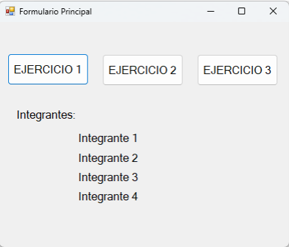
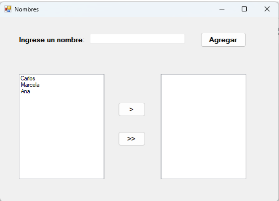
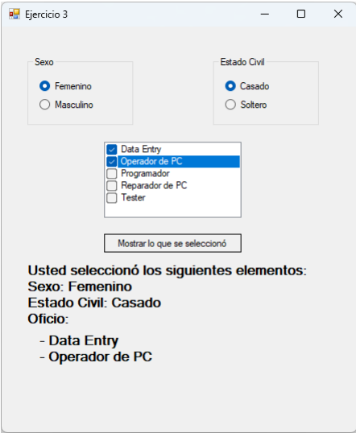

# Trabajo Practico 1 de Progamacion 3 UTN

## Implementacion
Se utilizo VIsual Studio 2022  para programar un modulo de windows forms que implementa funciones basicas de desarrollo sin persistencia. 

## Trabajo Practico:

### Formulario principal
Hacer un formulario principal que contenga los nombres de los integrantes del grupo y que
contenga tres botones. Cada botón abrirá cada ejercicio correspondiente.
En los ejercicios, realizar todas las validaciones posibles.



### Codigo implementado
```cs 
using System;
using System.Collections.Generic;
using System.ComponentModel;
using System.Data;
using System.Drawing;
using System.Linq;
using System.Text;
using System.Threading.Tasks;
using System.Windows.Forms;

namespace TP_1
{
    public partial class Form_Panel_Principal : Form
    {
        public Form_Panel_Principal()
        {
            InitializeComponent();
        }

        private void label1_Click(object sender, EventArgs e)
        {

        }

        private void Form1_Load(object sender, EventArgs e)
        {

        }

        private void BTN_Ejercicio_1_Click(object sender, EventArgs e)
        {
            Form_Ejercicio_1 Ejercicio1 = new Form_Ejercicio_1(this);
            Ejercicio1.Show();
            this.Hide();
        }

        private void BTN_Ejercicio_2_Click(object sender, EventArgs e)
        {
            Form_Ejercicio_2 Ejercicio2 = new Form_Ejercicio_2(this);
            Ejercicio2.Show();
            this.Hide();
        }

        private void BTN_Ejercicio_3_Click(object sender, EventArgs e)
        {
            Form_Ejercicio_3 Ejercicio3 = new Form_Ejercicio_3(this);
            Ejercicio3.Show();
            this.Hide();
        }

        private void ETI_LISTA_INTEG_Click(object sender, EventArgs e)
        {

        }
    }
}

```

## Ejercicio 1
Crear un formulario para agregar una lista de nombres a un ListBox mediante un TextBox.
Validar que no se ingresen valores en blanco. Validar que no se ingresen nombres repetidos,
incluso con letras mayúsculas, es decir: Carlos, carlos o CarLos, los tres casos se consideran
un mismo nombre repetido.
Luego de haber cargado algunos nombres, al seleccionar un ítem de la lista y hacer clic en
el botón con el signo > se pasará el ítem de la lista de nombres a la lista de la derecha. En
caso de no haber seleccionado ningún ítem de la lista y hacer clic en el signo > indicar con
un cartel aclaratorio que debe haber una selección.
Al seleccionar el botón con el signo >> se pasarán todos los ítems a la lista de la derecha,
eliminando los de la lista de la izquierda.



## Ejercicio 2
El programa tiene las siguientes características:
Se deben completar el TextBox Nombre y el TextBox Apellido y luego al dar clic en el botón
agregar se irán agregando a una lista de elementos. El botón Borrar, eliminara el elemento
seleccionado. En caso de no haber seleccionado ningún ítem de la lista y hacer clic en el
botón Borrar indicar con un cartel aclaratorio que debe haber una selección.

> **Tener en cuenta:**  
> * Los elementos deben aparecer ordenados alfabéticamente en la lista, aunque el
> operador los ingrese desordenados.
> * No aceptar nombres en blanco.
> * No aceptar apellidos en blanco.
> * Se deben completar los dos elementos, tanto nombre y apellido para que se pueda
> agregar.
> * No se podrá agregar el mismo nombre y apellido, validando mayúsculas y minúsculas,
> es decir Carlos Pérez y carlos pérez, son elementos repetidos.


### Ejercicio 3
El programa tendrá las siguientes características:
Por defecto estará seleccionado la opción Femenino y Casado. El usuario deberá elegir entre
estas opciones y luego al apretar el botón “Mostrar lo que se seleccionó” se mostrará todos
los elementos seleccionados por el usuario a través de un Label.
Las opciones seleccionadas no deben desactivarse luego de hacer clic en el botón Mostrar


### Codigo implementado:
```cs 
using System;
using System.Collections.Generic;
using System.ComponentModel;
using System.Data;
using System.Drawing;
using System.Linq;
using System.Text;
using System.Threading.Tasks;
using System.Windows.Forms;

namespace TP_1
{
    public partial class Form_Ejercicio_3 : Form
    {
        Form_Panel_Principal Principal;
        public Form_Ejercicio_3(Form_Panel_Principal Principal)
        {
            InitializeComponent();
            this.Principal = Principal;
            CHE_Puesto.Items.Add("Data Entry");
            CHE_Puesto.Items.Add("Operador de PC");
            CHE_Puesto.Items.Add("Operador");
            CHE_Puesto.Items.Add("Reparador de PC");
            CHE_Puesto.Items.Add("Tester");
        }

        private void Form1_Load(object sender, EventArgs e)
        {

        }

        private void Form_Ejercicio_3_FormClosed(object sender, FormClosedEventArgs e)
        {
            Principal.Show();
        }

        private void BTN_Borrar_Click(object sender, EventArgs e)
        {
            lblTask.Text = "";
            RAD_Femenino.Checked = true;
            RAD_Casado.Checked = true;

            foreach (int  item in CHE_Puesto.CheckedIndices)
            {
                CHE_Puesto.SetItemCheckState(((short)item), 0);
                
            }
        }

        private void button1_Click(object sender, EventArgs e)
        {
            lblTask.Text = "";
            if (RAD_Femenino.Checked) lblGender.Text = "Sexo: Femenino";
            else lblGender.Text = "Sexo: Masxulino";
            if (RAD_Casado.Checked) lblIsMarried.Text = "Estado Civil: Casado";
            else lblIsMarried.Text = "Estado Civil: Soltero";
            foreach (var item in CHE_Puesto.CheckedItems)
            {
                lblTask.Text += item+"\n";
            }
        }

        private void label2_Click(object sender, EventArgs e)
        {
  
        }
    }
}

```